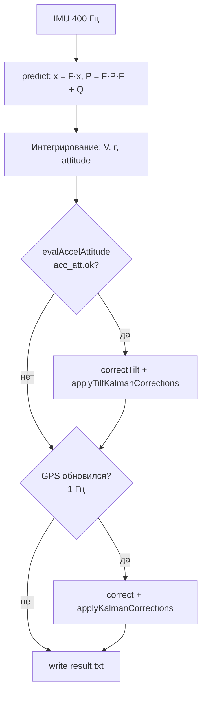

<div align="center">

# Фильтр Калмана в навигационном комплексе ITT_Students

### Выставка · коррекция по акселерометру · интеграция с СНС

| | |
|:---|:---|
| **Программа** | `imitator` |
| **Тип фильтра** | ошибочно-состоятельный EKF, 15 состояний |
| **Частота IMU** | 400 Гц (Опцианально)|
| **Частота СНС** | 1 Гц (Опцианально)|

</div>

---

## Аннотация

Документ описывает, как в проекте ITT_Students устроена автономная выставка и фильтр Калмана,
который сопровождает счисление БИНС. Основной акцент — на **коррекции тангажа и крена по
акселерометрам**: она выполняется на каждом такте IMU и в нашей реализации является
единственным рабочим каналом поддержания наклона. Отдельно разобран вопрос, зачем на
выставке оценивается смещение акселерометра **ba**, но не оценивается дрейф гироскопа **bg**.

> **Ключевая идея реализации.** Номинальная траектория (координаты, скорости, углы, ba, bg)
> интегрируется явно по IMU. Фильтр Калмана оценивает только **ошибки** этой траектории.
> После каждой коррекции ошибки «вливаются» в номинал и обнуляются — классическая
> error-state схема.

---

## Содержание

1. [Архитектура и поток данных](#1-архитектура-и-поток-данных)
2. [Начальная выставка](#2-начальная-выставка)
3. [Смещение ba и дрейф bg: зачем по-разному](#3-смещение-ba-и-дрейф-bg-зачем-по-разному)
4. [Модель фильтра Калмана](#4-модель-фильтра-калмана)
5. [Такт счисления nav::step](#5-такт-счисления-navstep)
6. [Коррекция по акселерометру](#6-коррекция-по-акселерометру) ← *основной раздел*
7. [Коррекция по СНС](#7-коррекция-по-снс)
8. [Итоги](#8-итоги)
9. [Ссылки на код](#9-ссылки-на-код)

---

## 1. Архитектура и поток данных

Программа `imitator` (`main.cpp`) работает в четыре этапа:

| Этап | Что происходит | Источник данных |
|:----:|----------------|-----------------|
| 1 | Чтение конфигурации выставки | `StartupNav.ini` |
| 2 | Автономная выставка (332 с **← Опцианально**) | `imu.dat` |
| 3 | Формирование начального `NavState` | углы из п.2, координаты из конфига |
| 4 | Основной цикл счисления + EKF | `imu.dat` + `gps.dat` + `angle.dat` |

На этапе 4 каждый такт IMU (2,5 мс) выполняется функция `nav::step()` из `trajectory.h`.
Параллельно с интегрированием БИНС работают **два контура коррекции** с разной частотой:



**Важно:** контур по акселерометрам срабатывает **400 раз в секунду**; контур по СНС —
только при появлении нового кадра GPS. Именно поэтому наклон держится акселерометрами,
а глобальная привязка (координаты, скорости, курс) — спутниковой навигацией.

---

## 2. Начальная выставка

Выставка реализована в `get_angle_start()` (`Aligner.cpp`). За 332 секунды по данным IMU
(фильтры Median + EMA, буфер 3000 отсчётов) вычисляются:

- начальный **курс** ψ — по горизонтальным проекциям угловой скорости Земли;
- **тангаж** θ и **крен** φ — по усреднённому вектору ускорений;
- начальное смещение акселерометров **ba**.

### 2.1. Углы из акселерометра и гироскопа

При неподвижном объекте акселерометр измеряет силу тяжести в связанной системе координат
(ССК) тела, искажённую собственным смещением и шумом:

```
                    f_b = C_bn · g_n + ba + n_a

    где    g_n = [0,  g,  0]ᵀ  — гравитация в навигационной СК,
           C_bn                 — матрица ориентации тела.
```

Из усреднённых компонент ускорения получают начальный наклон:

```
    θ = arcsin( ax / g )
    φ = atan2( −az,  ay )
```

Курс определяют по гироскопам — из проекций угловой скорости Земли на горизонт (после
оценки θ и φ):

```
    ψ = atan2( −ω_E,  ω_N )
```

### 2.2. Оценка смещения акселерометра

Когда углы найдены, по среднему вектору измерений вычисляют **ba** — разность между тем,
что показали акселерометры, и тем, что *должна* давать гравитация при найденной ориентации:

```
    ba = f_mean − C_bnᵀ · [0, g, 0]ᵀ
```

Результат записывается в `NavState::ba` через `initialAlignment(..., ba_init)` в `main.cpp`.

---

## 3. Смещение ba и дрейф bg: зачем по-разному

Частый вопрос: если на выставке оценивают **ba**, почему не оценивают **bg**?

Ответ не в том, что bg «не нужен» — он входит в состояние EKF (индексы x₁₂…x₁₄) и
уточняется в полёте. Различие в **роли датчиков на стационарной выставке**.

### 3.1. Акселерометры задают абсолютную опору для наклона

Ошибка **ba** смещает весь вектор кажущегося ускорения. Уже десятые доли м/с² (~0,01 g)
дают заметную ошибку θ и φ через `asin`/`atan2`. Без оценки ba:

- начальные θ, φ будут смещены;
- в цикле `ins::accel(row, ba)` останется систематическая составляющая;
- интегрирование скоростей и координат получит постоянное смещение.

Поэтому **ba на выставке необходим**.

### 3.2. Гироскопы на выставке нужен для курса, не для наклона

При покое гироскоп видит в основном **угловую скорость вращения Земли**
(≈ 7,3·10⁻⁵ рад/с ≈ 15°/ч). Она используется только для определения **направления**
(курса), а не для интегрирования угла на протяжении выставки.

Постоянный дрейф **bg** сдвигает все три компоненты ω, но:

- после 332 с усреднения (Median + EMA) влияние на *направление* вектора ω меньше,
  чем влияние ba на направление f;
- курс на выставке получают из **фазы** ω_Zem, а не накоплением ω·dt;
- на стационарной выставке bg **слабее наблюдаем**, чем ba (для его выделения нужны
  манёвры или вращение платформы).

В коде явно: `st.bg = {0, 0, 0}` при инициализации; уточнение bg — задача EKF в движении.

### 3.3. Сравнительная таблица

| Критерий | Смещение акселерометра **ba** | Дрейф гироскопа **bg** |
|----------|-------------------------------|-------------------------|
| Что определяет при покое | Направление g → **тангаж, крен** | Направление ω_Zem → **курс** |
| Масштаб влияния на углы | Ошибка ~ мм/с² → угловые минуты и градусы | Смещение ω; на выставке частично усредняется |
| Оценка на выставке | **Да**, `Aligner.cpp` | **Нет**, нули |
| Уточнение в полёте | EKF, x₉…x₁₁ | EKF, x₁₂…x₁₄ |
| Физический смысл | «Что лишнего показывает аксель в покое» | «Какой постоянный ω добавляет гироскоп» |

---

## 4. Модель фильтра Калмана

Реализация — в `ins_filter.h`. Используется **ошибочно-состоятельная** формулировка:
фильтр не интегрирует координаты напрямую, а оценивает отклонения номинала.

### 4.1. Вектор состояния (15 компонент)

| Группа | Индексы | Обозначение | Физический смысл |
|--------|---------|-------------|------------------|
| Координаты | x₀…x₂ | δφ, δλ, δh | ошибки широты, долготы, высоты |
| Скорость | x₃…x₅ | δVn, δVh, δVe | ошибки скоростей в навигационной СК |
| Углы | x₆…x₈ | δψ, δθ, δφ | ошибки курса, тангажа, крена |
| Аксель | x₉…x₁₁ | δba | текущая ошибка оценки смещения акселерометра |
| Гироскоп | x₁₂…x₁₄ | δbg | текущая ошибка оценки смещения гироскопа |

Начальная ковариация P₀ задаётся в `initialCovariance()` (`aligner.h`): неопределённость
позиции ~50 м, скорости ~2,5 м/с, курса ~15°, наклона ~1°.

### 4.2. Этапы predict и correct

**Predict** (на каждом такте IMU):

```
    x  ←  F · x
    P  ←  F · P · Fᵀ  +  Q
```

Матрица F (`Fj_matrix`) связывает ошибки ориентации, скорости, координат и дрейфы датчиков.
Матрица Q (`Qj_matrix`) — дискретный шум процесса (σ_g, σ_a, σ_ba, σ_bg).

**Correct** (при наличии измерений):

```
    z  =  z_измерение  −  H · x          — инновация
    S  =  H · P · Hᵀ  +  R
    K  =  P · Hᵀ · S⁻¹
    x  ←  x  +  K · (z − H · x)
    P  ←  (I − K · H) · P
```

После correct вызывается `applyKalmanCorrections` или `applyTiltKalmanCorrections`:
оценённые ошибки вычитаются из номинала, x обнуляется.

---

## 5. Такт счисления nav::step

Ниже — логическая последовательность одного такта (400 Гц) в терминах кода `trajectory.h`.

**Шаг 1 — предсказание фильтра.** По dt и текущему состоянию строится F, обновляются x и P.

**Шаг 2 — интегрирование БИНС.**

- ускорение в навигационной СК: `n_nav = C · (f_raw − ba)`;
- скорости и координаты — методом трапеций с учётом вредных ускорений;
- углы — интегрирование гироскопа `(ω_raw − bg)` через скорости Эйлера.

**Шаг 3 — коррекция по акселерометру** (раздел 6). Выполняется, если объект близок к
«чистому» покою по акселю и гироскопу.

**Шаг 4 — коррекция по СНС** (раздел 7). Только если `do_correction == true` (новый кадр GPS).

**Шаг 5 — запись** исправленного решения в `result.txt` через `makeResult()`.

---

## 6. Коррекция по акселерометрам

> Это центральный механизм поддержания тангажа и крена в нашей реализации.
> GPS наклон **не** корректирует (см. §6.5).

Коррекция состоит из четырёх связанных функций в `trajectory.h` / `ins_filter.h`:

```
    evalAccelAttitude  →  correctTilt  →  applyTiltKalmanCorrections
         (оценка)           (EKF update)        (применение к номиналу)
```

### 6.1. Формирование опорного наклона — evalAccelAttitude

Сначала из сырых данных IMU получают ускорение в ССК (связанной ск) тела с вычтенным ba
(`ins::accel`). Затем из кажущегося ускорения убирают центростремительную составляющую
`V̇` (переведённую в ССК тела), чтобы осталась преимущественно гравитация:

```
    a_x = f_x − V̇_x
    a_y = f_y − V̇_y
    a_z = f_z − V̇_z
```

Опорные углы наклона по направлению вектора a:

```
    θ_acc = atan2( a_x,  a_y )
    φ_acc = −atan2( a_z,  a_y )
```

*(На выставке для θ используется asin(ax/g); в полёте — atan2 — другая геометрия
тех же проекций на оси тела.)*

### 6.2. Gating — когда акселерометру доверяют

Коррекция **не выполняется**, если объект маневрирует. Флаг `acc_att.ok` истинен
только при одновременном выполнении двух условий:

| Проверка | Порог | Смысл |
|----------|-------|-------|
| `|‖a‖ − g| ≤ 0,2` м/с² | 0,2 | нет сильной поступательной перегрузки |
| `‖ω_raw‖ ≤ 0,08` рад/с | 0,08 | нет быстрого вращения |

Если хотя бы одно нарушено — σ_pitch, σ_roll устанавливаются в 10⁶ рад
(`SIG_TILT_IGNORE`), и `correctTilt` фактически не вносит поправку.

### 6.3. Адаптивный шум измерений R

При выполнении gating доверие к акселерометрам вычисляется плавно:

```
    trust_acc  = 1 − |‖a‖ − g| / 0,2
    trust_gyro = 1 − ‖ω‖ / 0,08
    trust      = max( 0,05,  trust_acc · trust_gyro )

    σ_tilt = 0,5° + (1 − trust) · (5° − 0,5°)
```

Чем ближе режим к идеальному покою, тем **меньше** σ_tilt и тем **сильнее** фильтр
доверяет акселерометрам. На границе допусков trust не падает ниже 0,05 — коррекция
не отключается резко.

### 6.4. Обновление Kalman — correctTilt

Формируется двумерный вектор измерений (только тангаж и крен):

```
    z = │ wrap( θ_INS − θ_acc ) │
        │ wrap( φ_INS − φ_acc ) │
```

Матрица наблюдения H (`H_tilt_matrix`) имеет единичные элементы только в столбцах,
соответствующих x₇ (δθ) и x₈ (δφ). Далее — стандартный Kalman update с R(σ_pitch, σ_roll).

После update вызывается **applyTiltKalmanCorrections**:

```
    θ  ←  θ  − x₇          φ  ←  φ  − x₈
    ba ← ba + x₉…₁₁        bg ← bg + x₁₂…₁₄
    x₇…x₁₄ ← 0
```

Обратите внимание: хотя H «смотрит» только на углы, через недиагональные элементы P
и связи в F коррекция по наклону **косвенно уточняет ba и bg**.

### 6.5. Почему GPS не дублирует эту коррекцию

На кадрах СНС (1 Гц) вызывается полный `ins::correct` с 9 измерениями. Однако в
вектор эталона SNS для pitch и roll **подставляются текущие значения INS**:

```cpp
    const Vector sns = { ref.lat, ref.lon, ref.alt,
                         ref.vn,  ref.vh,  ref.ve,
                         ref.heading,
                         st.att.pitch,   // ← из INS, не из angle.dat
                         st.att.roll };  // ← из INS, не из angle.dat
```

Инновация по наклону обнуляется; дополнительно σ_tilt = 10⁶. Курс при этом
корректируется по `angle.dat` (σ_ψ = 1°).

**Итог:** тангаж и крен в нашей системе — зона ответственности **акселерометра на 400 Гц**;
СНС отвечает за привязку траектории и курс.

---

## 7. Коррекция по СНС

Раз в секунду (при обновлении `gps.dat`) формируется 9-мерная инновация:

```
    z = z_INS − z_SNS

    z_INS, z_SNS = ( lat, lon, alt, Vn, Vh, Ve, ψ, θ, φ )
```

Диагональная матрица R (`Rj_matrix`):

| Компонента | σ (типичное) |
|------------|--------------|
| lat, lon | ~5 м (в радианах) |
| alt | ~5 м |
| Vn, Vh, Ve | ~0,1 м/с |
| ψ (курс) | ~1° (из angle.dat) |
| θ, φ | 10⁶ (отключены) |

`applyKalmanCorrections` корректирует все группы ошибок и переносит поправки в номинал
(координаты, скорости, углы, ba, bg).

---

## 8. Итоги

**Выставка.** Смещение акселерометров ba оценивается обязательно: без него ломаются
и начальный наклон, и последующее интегрирование ускорений. Дрейф гироскопа bg на
выставке не выделяют — его роль на этом этапе меньше, а уточнение поручено EKF.

**В полёте.** Два контура Kalman дополняют друг друга:

- **400 Гц, акселерометр** — удерживает тангаж и крен, когда нет перегрузок;
- **1 Гц, СНС** — привязывает координаты, скорости и курс.

**Практический вывод для анализа траектории.** Если на графике расходятся θ и φ с
эталоном angle.dat — это ожидаемо в части архитектуры (GPS наклон не тянет); смотреть
нужно на работу `evalAccelAttitude` и gating. Если расходятся lat/lon/ψ — смотреть
контур СНС и качество gps.dat / angle.dat.

---

## 9. Ссылки на код

| Функция / файл | Назначение |
|----------------|------------|
| `main.cpp` | точка входа, вызов выставки и цикла |
| `Aligner.cpp` → `get_angle_start` | выставка: ψ, θ, φ, ba |
| `aligner.h` → `initialAlignment`, `initialCovariance` | начальный NavState и P₀ |
| `trajectory.h` → `step` | один такт счисления |
| `trajectory.h` → `evalAccelAttitude` | опорный наклон + gating |
| `ins_filter.h` → `correctTilt` | EKF update по θ, φ |
| `ins_filter.h` → `correct` | EKF update по СНС (9 измерений) |
| `ins_filter.h` → `predict`, `Fj_matrix`, `Qj_matrix` | predict-этап |
| `imu_processor.h` → `accel`, `gyro` | компенсация ba, bg |

---

<div align="center">

*ITT_Students · imitator · документ `docs/kalman_filter_report.md`*

</div>
